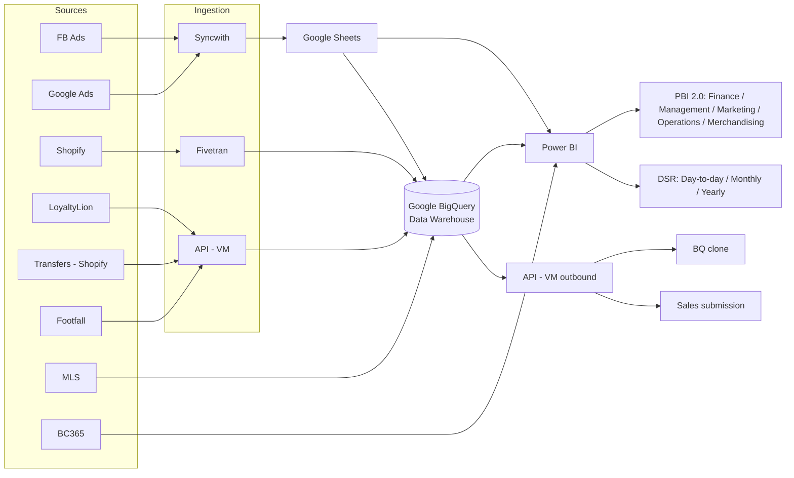

# 📊 MSR Daily Sales Report — Power BI

An end-to-end retail sales reporting solution built in **Power BI**, covering daily, monthly, and yearly performance across physical outlets, consignment, online, pop-up, and wholesale channels in **Malaysia (MY)** and **Singapore (SG)**.

The report gives management and outlet teams one place to track sales against target, compare periods, spot under-performing outlets early, and project month-end results.

---

## 🧰 Tech Stack

| Layer | Tools |
|---|---|
| Data sources | Shopify, MLS, Business Central 365 (BC365), LoyaltyLion, Footfall, Facebook Ads, Google Ads |
| Ingestion | Fivetran, Syncwith, custom API (VM) |
| Storage / warehouse | Google BigQuery, Google Sheets |
| Modelling & reporting | Power BI (Power Query, DAX, star-schema data model) |
| Documentation | draw.io |

---

## 🏗️ Data Architecture

The full diagram is in [`data_flow_diagram.drawio`](data_flow_diagram.drawio) and can be opened at [app.diagrams.net](https://app.diagrams.net).

---

## 🗂️ Data Model

  

Click an image to view it full size.

---

## 📄 Report Pages

### 1. Day-to-Day Analysis — MY (Shopify)

Daily and month-to-date view of sales performance, filterable by outlet, date, financial year / quarter / month, and custom date range.

**Key features**
- **Headline KPIs:** MTD sales, last-year MTD, % change, yesterday's sales, and the MVP outlet of the month
- **Performance cards:** Total Sales, Monthly Target (with % achieved), Total Orders, Total Quantity, AOV, and AvSP
- **Top 5 and Bottom 5 outlets** by sales
- **Sales by channel:** Outlet, Consignment, Online, Pop-up, Wholesale (SG)
- **Last 3 weeks sales by day** to show day-of-week patterns
- **Current month vs. last MTD vs. last year MTD**
- **Online sales by marketplace:** Brand.com, Shopee, Lazada, Zalora, TikTok, Amazon
- **Outlet target table** with achievement % and remaining balance to target
- **Extrapolated sales** by outlet and in total against the monthly target
- **Compare Sales:** any two date ranges side by side, with difference, % target, and GP%

  
  

Click an image to view it full size.

### 2. Monthly Analysis — MY (BC365)

Month-level view of sales performance sourced from **Business Central 365**, used for month-end reviews, target tracking, and outlet productivity analysis. Filtered by a single **Year / Month** slicer.

**Key features**
- **Target gauge:** total sales for the month against the monthly target, with % achieved
- **Headline KPIs:** Total Orders, Total Quantity, Total Sales, and Total Target, each with a % change indicator
- **Channel breakdown cards:** orders, quantity, sales, and target split by Outlet, Online, and Consignment
- **Total Sales vs. Last Year Whole Month by Outlet:** current-year sales, last year's sales for the same month, and this month's target marker for each outlet
- **Sales by channel type:** share of Outlet, Online, Consignment, and Wholesale (SG)
- **Average Basket Value** by outlet, to compare spend per transaction across stores
- **Return per Square Foot (RM/sqft)** by outlet, alongside an outlet size reference table, to measure space productivity
- **Online sales by marketplace** (Brand.com, Shopee, Lazada, Zalora, TikTok, Amazon) and **online target by marketplace**
- **Sales contribution by payment type:** Cash, Cashless, and mixed
- **Outlet target table:** actual sales, sales target, MSP target, target remaining, and MSP remaining
- **Daily sales by channel type:** day-by-day sales for Outlet, Online, Consignment, and Wholesale (SG)
- **Daily sales by outlet:** a day-by-outlet matrix for spotting slow days or missing data at store level

  
  
  

Click an image to view it full size.

### 3. Yearly Analysis — MY (BC365)

Financial-year view of business performance sourced from **Business Central 365**, covering **FY 18/19 to FY 26/27**. Used for annual planning, year-over-year comparison, and full-year projection. Filtered by a **Financial Year** button slicer.

**Key features**
- **MVP outlet of the year:** the top-selling outlet for the selected financial year
- **Target gauge:** year-to-date sales against the YTD target, with % achieved
- **Headline KPIs:** Total Orders, Total Quantity, and Total Sales, each with % change vs. last year, plus Total Target YTD and Total Target FY
- **Channel breakdown cards:** orders, quantity, sales, and target split by channel type (Outlet, Online, Pop-up, and others)
- **Total Sales vs. Last Year YTD by Outlet:** current-year sales, last year's YTD sales, and the current sales target marker for each outlet
- **Target Achievement by Outlet:** a diverging bar chart showing how far each outlet is above (green) or below (red) its target
- **Sales by channel type, this year vs. last YTD:** side-by-side pies for Outlet, Franchise, Consignment, Online, Pop-up, and Wholesale (SG)
- **Total Sales by Year (Extrapolated):** yearly sales across financial years, with the current year's projected full-year balance stacked on top. Toggle between **By Date** and **Extrapolated**, and filter by Type and Outlet
- **Total Cumulative Sales by Month:** running total of sales through the financial year (April to March), one line per FY. Toggle between **By Month** and **Cumulative**
- **Monthly sales matrix:** sales by channel type, outlet, and financial year for each month
- **Month-by-month FY comparison:** monthly sales for each financial year with the difference and % difference, marked with up/down indicators

  
  
  

Click an image to view it full size.

### 4. Additional pages
- **Festive Analysis:** performance during festive seasons
- **Forecast:** projected sales

---

## 📐 Key Measures

| Measure | Definition |
|---|---|
| Total Sales | Net sales for the selected period |
| MTD Sales | Month-to-date sales |
| Δ Sales % | (MTD Sales − Last Year MTD) ÷ Last Year MTD |
| AOV (Average Order Value) | Total Sales ÷ Total Orders |
| AvSP (Average Selling Price) | Total Sales ÷ Total Quantity |
| Target Achievement % | Total Sales ÷ Monthly Target |
| Target Balance | Total Sales − Monthly Target |
| Extrapolated Sales | Projected month-end sales based on performance to date |
| GP% | (Sales − Cost) ÷ Sales, with cost sourced from MLS |
| Average Basket Value | Outlet sales ÷ number of transactions |
| Return per Square Foot | Outlet sales ÷ outlet size (sqft) |
| Target Remaining | Actual Sales − Sales Target (negative means still short of target) |
| YTD Sales | Sales from the start of the financial year (April) to date |
| YoY % | (This year − Last year) ÷ Last year |
| Extrapolated Sales (Year) | Projected full financial-year sales based on performance to date |
| Cumulative Sales | Running total of sales by month within a financial year |

---

## 📁 Repository Contents

| File | Description |
|---|---|
| `MSR @ Daily Sales Report.pbix` | Power BI report file |
| `data_flow_diagram.drawio` | Data pipeline and architecture diagram |
| `README.md` | Project documentation |

---

## ▶️ How to Use

1. Install [Power BI Desktop](https://powerbi.microsoft.com/desktop/) (Windows).
2. Clone or download this repository.
3. Open `MSR @ Daily Sales Report.pbix`.
4. Use the slicers (Outlet, Date, FY/Quarter/Month, Date Range) to explore the data.

> **Note:** Live data connections (BigQuery, BC365, Google Sheets) require credentials and will not refresh outside the original environment. The report opens with the last cached data.

---

## 👤 Author

**Hazwan Othman**
Data Analyst · Power BI · SQL · BigQuery

[GitHub](https://github.com/hazwanothman)
