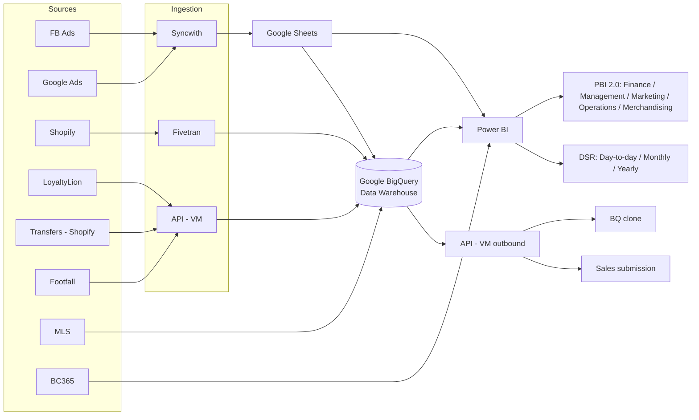

# 📊 MSR Daily Sales Report — Power BI

An end-to-end retail sales reporting solution built in **Power BI**, covering daily, monthly, and yearly performance across physical outlets, consignment, online, pop-up, and wholesale channels in **Malaysia (MY)** and **Singapore (SG)**.

The report gives management and outlet teams one place to track sales against target, compare periods, spot under-performing outlets early, and project month-end results.

---

## 🧰 Tech Stack

| Layer | Tools |
|---|---|
| Data sources | Shopify, MLS, Business Central 365 (BC365), LoyaltyLion, Footfall, Facebook Ads, Google Ads |
| Ingestion | Fivetran, Syncwith, custom API (VM) |
| Storage / warehouse | Google BigQuery, Google Sheets |
| Modelling & reporting | Power BI (Power Query, DAX, star-schema data model) |
| Documentation | draw.io |

---

## 🏗️ Data Architecture

The full diagram is in [`data_flow_diagram.drawio`](data_flow_diagram.drawio) and can be opened at [app.diagrams.net](https://app.diagrams.net).

---

## 🗂️ Data Model

---

## 📄 Report Pages

### 1. Day-to-Day Analysis — MY (Shopify)

Daily and month-to-date view of sales performance, filterable by outlet, date, financial year / quarter / month, and custom date range.

**Key features**
- **Headline KPIs:** MTD sales, last-year MTD, % change, yesterday's sales, and the MVP outlet of the month
- **Performance cards:** Total Sales, Monthly Target (with % achieved), Total Orders, Total Quantity, AOV, and AvSP
- **Top 5 and Bottom 5 outlets** by sales
- **Sales by channel:** Outlet, Consignment, Online, Pop-up, Wholesale (SG)
- **Last 3 weeks sales by day** to show day-of-week patterns
- **Current month vs. last MTD vs. last year MTD**
- **Online sales by marketplace:** Brand.com, Shopee, Lazada, Zalora, TikTok, Amazon
- **Outlet target table** with achievement % and remaining balance to target
- **Extrapolated sales** by outlet and in total against the monthly target
- **Compare Sales:** any two date ranges side by side, with difference, % target, and GP%

### 2. Monthly Analysis — MY (BC365)

Month-level performance sourced from Business Central 365.

### 3. Yearly Analysis — MY (BC365)

Year-over-year trends and long-term performance.

### 4. Additional pages
- **Festive Analysis:** performance during festive seasons
- **Forecast:** projected sales

---

## 📐 Key Measures

| Measure | Definition |
|---|---|
| Total Sales | Net sales for the selected period |
| MTD Sales | Month-to-date sales |
| Δ Sales % | (MTD Sales − Last Year MTD) ÷ Last Year MTD |
| AOV (Average Order Value) | Total Sales ÷ Total Orders |
| AvSP (Average Selling Price) | Total Sales ÷ Total Quantity |
| Target Achievement % | Total Sales ÷ Monthly Target |
| Target Balance | Total Sales − Monthly Target |
| Extrapolated Sales | Projected month-end sales based on performance to date |
| GP% | (Sales − Cost) ÷ Sales, with cost sourced from MLS |

---

## 📁 Repository Contents

| File | Description |
|---|---|
| `MSR @ Daily Sales Report.pbix` | Power BI report file |
| `data_flow_diagram.drawio` | Data pipeline and architecture diagram |
| `README.md` | Project documentation |

---

## ▶️ How to Use

1. Install [Power BI Desktop](https://powerbi.microsoft.com/desktop/) (Windows).
2. Clone or download this repository.
3. Open `MSR @ Daily Sales Report.pbix`.
4. Use the slicers (Outlet, Date, FY/Quarter/Month, Date Range) to explore the data.

> **Note:** Live data connections (BigQuery, BC365, Google Sheets) require credentials and will not refresh outside the original environment. The report opens with the last cached data.

---

## 👤 Author

**Hazwan Othman**
Data Analyst · Power BI · SQL · BigQuery

[GitHub](https://github.com/hazwanothman)
